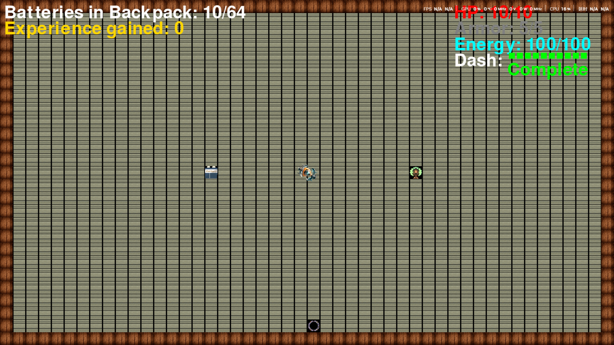

# Z2H: Zero to Hero
This is a 2D shooting game built on Python and Pygame. 
Control your character, shoot enemies, and with the help of your movement and skills, go through challenging levels and take back everything you get from the levels.

## Graphical Abstract



## Purpose of the Software

- **Agile** software development process is applied.
- **Reasons to choose Agile**: This is the development process of a game. Ideas and designs for the game will emerge as the development process progresses, and    the original plan may change. We use **Agile** to cope with a more flexible development process.
- **Possible usage of your software**: Stand-alone games, daily entertainment.

## Software Development Plan

### **Development Process**：
- **Types of software development process**：**Agile**.
- **Reason**: We chose **Agile** because it allows for rapid iteration and adaptability to changing requirements.
- **Development Steps**:
  1. Requirements analysis: Determine the features and game types.
  2. Design: Design the user interface and gameplay.
  3. Coding: Implement core features.
  4. Testing: Conduct unit testing or user testing.
  5. Deployment/demonstration: Prepare a demo version.
- **Development tools and environment used**:
  1. Programming Language：Python.
  2. Library：Pygame.
  3. Version Control：Git、GitHub.
  
### **Members (Roles & Responsibilities & Portion)**
- **P2321054, Jimmy**:
- **P, Maple**:

### **Schedue**
| Stages                  | Time Range           | Description                                          |
|-------------------------|----------------------|------------------------------------------------------|
| Requirements analysis   |     ~      - 04.02   | Determine the features and game types.               |
| Design                  | 2025.04.03 - 04.03   | Design the user interface and gameplay.              |
| Coding                  | 2025.04.04 - 04.21   | Implement core features.                             |
| Testing                 | 2025.04.04 - 04.21   | Conduct unit testing or user testing and bug fixes.  |
| Deployment/demonstration| 2025.04.22 - 04.22   | Prepare a demo version and README.md document.       |

### **Current status of our software**
- **Development progress**: The overall framework of the game has been implemented, and players can control the characters to **move**, **interact** and **attack** normally in the game.
- **Running status**: The software can be run on devices with the **Pygame library installed**, but some functions have bugs.
- **Implemented functions**:
  1. The player controls the character to **move**.
  2. The player controls the character to **attack**.
  3. Interact with the in-game **battery inventory**/**property tree**.
  4. **Enemy** system.
  5. Simple level switching.
  6. See the video demo for more details...

### **Future plan**
- **Complete level production**
- **Complete property tree mechanism**
- **Design unique textures using Mid Journey**
- **Fix all current bugs**
- **Optimize the attack mechanism**
- **Optimize existing code logic**
- **Package into .exe file**
  
## Features

- **Player Controls**：Use the keyboard (WASD or arrow keys) to move, the mouse to control the attack direction, and click the left button to shoot.
- **Energy Management**：Shooting and using skills consumes energy, which regenerates over time.
- **Battery Management**：Collect batteries in the main level and bring them back to the starting lobby to store them in the battery warehouse.
- **Game scene**：Contains the start hall and the main level, which players can enter by interacting with the portal.
- **HUD Display**：The screen displays the player's inventory of batteries, health, armor, and energy in their backpack.

## Installation Guide

1. Make sure you have Python 3.x installed (recommended version).
2. Installing Pygame (In fact, this step is not necessary, because the setup.py in the project will detect and install the dependent environment when running main.py.)：
   ```bash
   pip install pygame
   
## Instructions
- **Start the game**：
1. Run the main.py file.
2. Make sure the input method is US keyboard (ENG).

- **Player Controls**：
1. Move the mouse to control the attack direction. 
2. Click the left mouse button to attack and destroy.
3. Use the **W**, **A**, **S**, **D** keys or the **Arrow Keys** to control the character's movement.
4. Use the **F** key to release skills.
5. Use the **E** key to interact with the battery warehouse/property tree/portal/door in the scene.
6. Use the **Escape (Esc)** key to exit the game at any time.

- **Screen Display**：
1. The upper left corner shows the real-time battery count in the player's backpack.
2. The upper right corner displays the player's real-time health, armor, and energy attributes, as well as the skill cooldown time.

- **Game Mechanics**：
1. When a player is damaged, the armor value is deducted first; when the armor value is 0, the health value is deducted.
2. The player's attack, destruction and skill release will consume energy.
3. Energy automatically regenerates over time.
4. The player has a backpack feature, which is used to store batteries and other items obtained from the levels.
5. Battery mechanism: Batteries can be obtained from within the level and used to delay the closing time of the portal.

## Project Structure
```
ZeroToHero/
├── main.py           # Main game loop
├── bullet.py        # Bullet mechanics
├── player.py        # Player logic
├── enemy.py         # Enemy logic
├── starthall.py     # Starthall scene
├── docs/            # Documentation and screenshots
├── constants.py     # Constants used
├── initial.py       # Initialize the game 
├── load.py          # Load game textures and other resources
├── render.py        # Render various prompts and hud in the game
├── setup.py         # Detect and install environment dependencies
├── menu.py          # UI menu related logic
└── Images           # Necessary game textures
└── README.md        # This file
```
